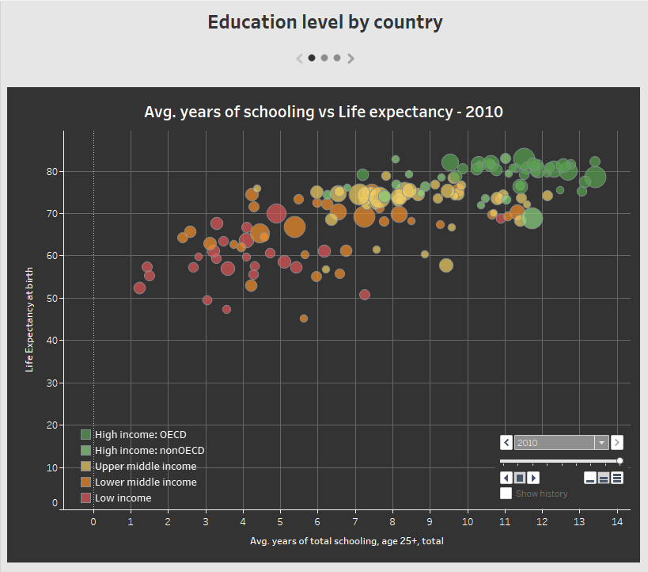

# Education data 
Cleaning data regarding education from https://data.worldbank.org/.  
Using Python data science packages:
- numpy, 
- pandas, 
- matplotlib, 
- seaborn  

Data used in this project can be downloaded under: 
https://databank.worldbank.org/data/download/Edstats_csv.zip

# Visualization
Clean data was used to prepare visualization in Tableau. 
You can view it on Tableau Public using following link: 
https://public.tableau.com/profile/magda.w.jcicka#!/vizhome/EducationLevel_16182628156150/Educationlevelbycountry 

# Documentation
Documentation is available online:
https://magdaw19.github.io/Cleaning-Data/education.html

